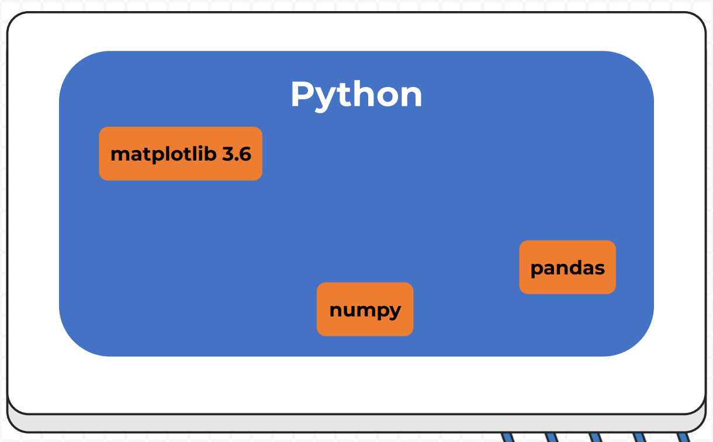
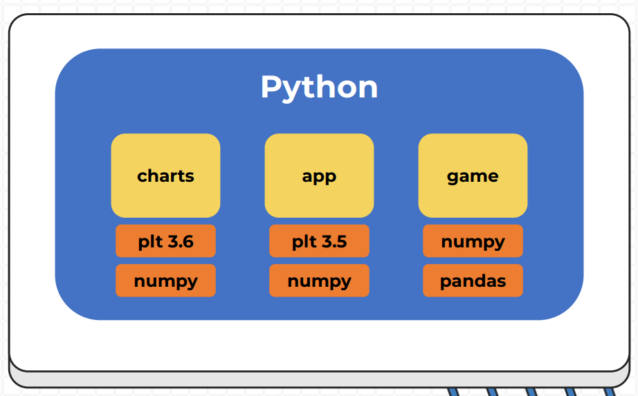

# Ambientes Virtuales

## ¿Qué es un ambiente virtual?

Instalar módulos y pquetes a nivel global puede causar problemas al momento de manejar varios ´royectos, por ejemplo, ára algunos proyectos necesitas otro tipo de versión de python, librerías o módulos. Para soluciónar esto se crea un ambiente virtual en cual se encapsula cada proyecto y no lo deja de forma compartida.

El ambiente global de python, se puede ver en la siguiente imagen:



Se ven los módulos de forma general, lo que puede cuasr problemas de versiones. La solución es crear un entorno virtual para cada proyecto de forma que se encapsulan los modulos y los atan a cada proyecto.



Cada proyecto tiene sus propias dependencias y sus propias versiones.

Los **entornos virtuales** son una forma de crear un sistema operativo virtual dentro de otro sistema operativo. Esto permite a un usuario tener varios sistemas operativos diferentes en un mismo equipo físico, lo que puede ser muy útil en situaciones en las que es necesario utilizar diferentes aplicaciones o tecnologías que requieren entornos diferentes

## Ventajas de los entornos virtuales

- Permiten utilizar varios sistemas operativos en un mismo equipo físico
- Permiten instalar y utilizar diferentes aplicaciones y tecnologías de manera segura, sin tener que hacer cambios permanentes en el sistema operativo principal
- Pueden ser fácilmente movidos o copiados, lo que significa que pueden ser utilizados en diferentes equipos o compartidos con otros usuarios
- También pueden ser fácilmente respaldados y restaurados en caso de que se produzca un problema, lo que puede ayudar a prevenir la pérdida de datos o el tiempo de inactividad
- Ofrecen una forma conveniente y segura de utilizar diferentes aplicaciones y tecnologías en un mismo equipo

> 📝 **Nota:** En resumen, los entornos virtuales ofrecen una forma conveniente y segura 🔒 de utilizar diferentes aplicaciones y tecnologías en un mismo equipo, lo que puede ser muy útil para muchos usuarios y situaciones diferentes

## Creando entornos virtuales en Python

Primero se debe ver dónde se esta ejecutando Python, la ubicación del archivo binario se puede ver con el comando `which`

```sh
which python3
/usr/bin/python3
```

Al estar en Linux o WSL tenemos que intalar un paquete extra

```sh
sudo apt install -y python3-venv
```

> 📝 **Nota:** "*venv*" significa *virtual enviroment*

Una vez instalado, se puede crear un ambiente para cada proyecto, para esto se debe entrar a la carpeta del proyecto e ingresar el siguiente comando

```sh
python3 -m venv <Nombre del ambiente virtual>
```

> 📝 **Nota:** Normalmente se nombra el ambiente virtual como "*env*"

Para activar el ambiente se ingresa lo siguiente

```sh
source <Nombre del ambiente virtual>/bin/activate
```

Para desactivar se hace

```sh
deactivate
```

Una vez que se activa el ambiente virtual podemos instalar las librerias necesarias en el ambiente virtual, por ejemplo:

```sh
pip3 install matplotlib==3.5.0
```

## Archivo de requerimientos

Archivo que gestiona todas las dependencias y en que versiones se necesitan.

Generar el archivo con el siguiente comando

```sh
pip3 freeze > requirements.txt
```

Revisar lo que hay dentro del archivo

```sh
cat requirements.txt
```

Instalar las dependencias necesarias para contribuir más rápido en proyectos

```sh
pip3 install -r requirements.txt
```

## Hacks

Cree estos alias para ayudar con el manejo de ambientes virtuales

```sh
# Python venv
alias cvenv='python3 -m venv venv'
alias onvenv='source venv/bin/activate'
alias offvenv='deactivate'
# Ambientes virtuales con otro nombre
alias onmyvenv='function _activate_env(){ source "$1/bin/activate" && echo "Activado"; }; _activate_env'
alias mkvenv='function _mkvenv(){ python3 -m venv "$1" && echo "Entorno virtual '$1' creado exitosamente"; }; _mkvenv'
```
