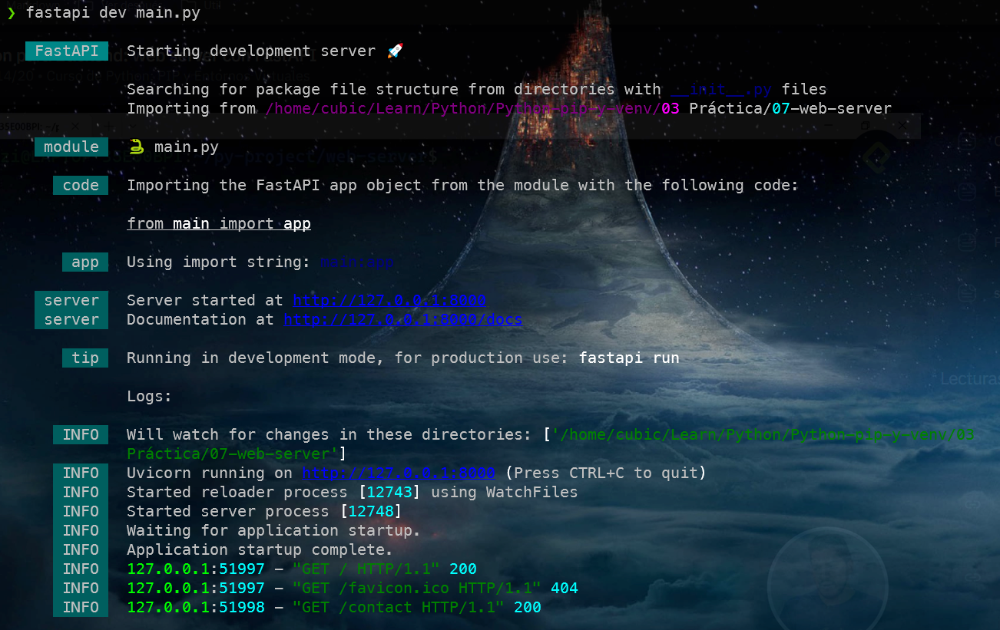

# Fast API

[◀️](./../README.md)

Es una librería para crear servicios web.

## Instalación

Para usar esta librería primero debe instalarse el módulo de python dentro de un entono virtual. [1]

```sh
# Crear entorno virtual
python -m venv venv
# Activar entorno virtual
source .venv/bin/activate
# Ver que se activo el entorno
which python
# Actualizar pip
python -m pip install --upgrade pip
# Instalar paquete
pip install "fastapi[standard]"
```

## Importación

Se debe importar el módulo **FastAPI** y hacer una instacia de una aplicación

```python
from fastapi import FastAPI

app = FastAPI()
```

## Ejemplo de uso

Para crear un recurso se hace con una función con un decorador.

```python
@app.get('/')
def get_list():
    return [1,2,3,4]
```

Dentro de los argumentos del get se ingresa la ruta desde la cual va a poder ingresar desde la web.

## Ejecución

El servidor se ejecuta con el comando (ejecutando en un ambiente virtual):

```sh
fastapi dev main.py
```



Se puede ingresar a la IP y al puerto que nos muestra el log, en este caso se ingresa a *http://127.0.0.1:8000/* desde un navegador.

> 📝 **Nota:** Para apagar el servidor se presiones `Ctrl` + `C`

Tambíen se puede usar uvicorn para ejecutar el servicio.

```sh
uvicorn main:app --reload
```

Pero antes se debe instalar con

```sh
pip install "uvicorn[standard]"
```

## Respuestas con HTML

Así como se pueden retornar datos, se puede enviar HTML, se debe importar lo siguiente

```python
from fastapi.responses import HTMLResponse
```

De esta forma se puede tne run método que retorne HTML.

```python
@app.get('/contact/', response_class=HTMLResponse)
def get_list():
    return """
        <h1>Hola!</h1>
        <p>Bienvenido.</p>
    """
```

<!-- Referencias -->

[1]: <https://fastapi.tiangolo.com/#installation> "Instalación FastAPI"
