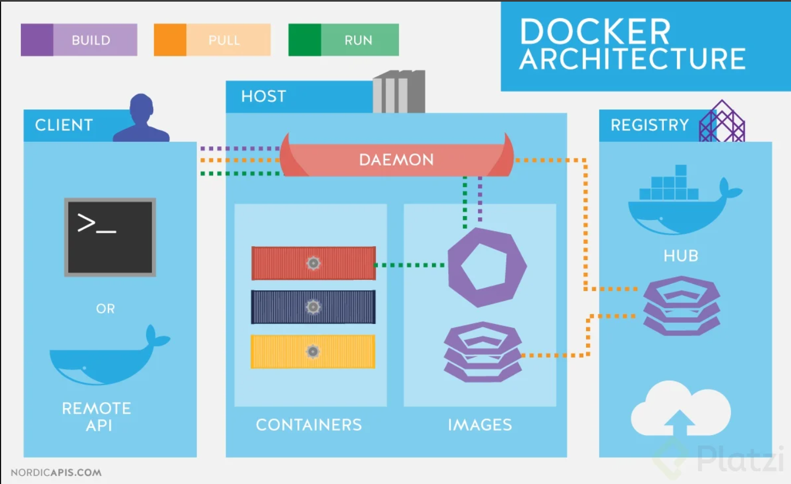
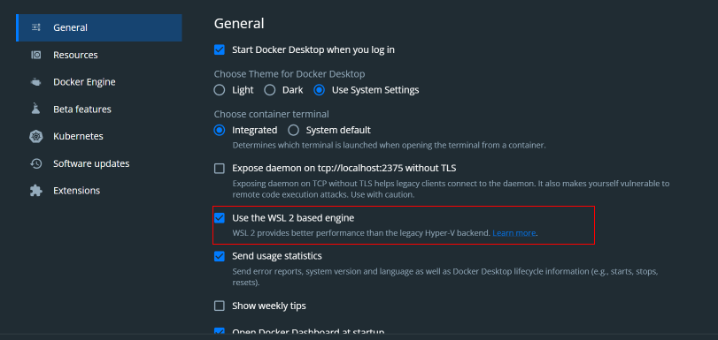
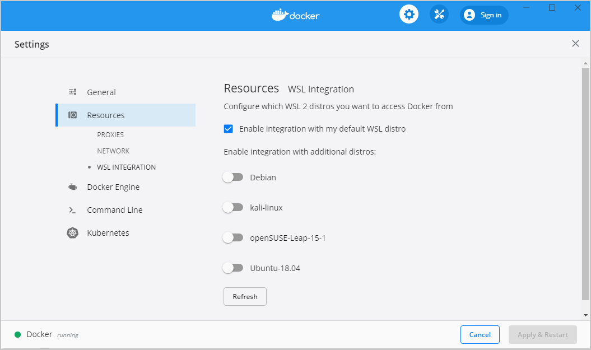
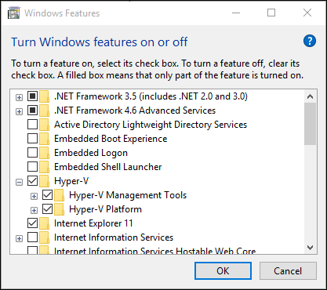

# Docker

[◀️](./../README.md)

Es una herramienta que sirve para aislar entornos. Sirve para casos en los que no solo necesites aislar modulos de python, si no también el entorno de ejecución y la verisón de Pyhton. Esto lo hace usando **contenedores**.

También, asegura hacer despliegues de nuestra computadora a la nube. [1]

Docker es una plataforma de código abierto que permite crear, distribuir y ejecutar aplicaciones de forma independiente del sistema operativo subyacente. Proporciona una forma eficiente y rápida de crear entornos aislados llamados contenedores, que encapsulan una aplicación y todas sus dependencias, incluyendo bibliotecas, frameworks y herramientas necesarias para su funcionamiento.

## Características de Docker

- **Contenedores**: Los contenedores son entornos ligeros y portátiles que permiten empaquetar una aplicación y sus dependencias en una unidad autónoma. Cada contenedor se ejecuta de manera aislada, lo que significa que no se ve afectado por el sistema operativo o las aplicaciones que se ejecutan en el host.

- **Imágenes**: Una imagen de Docker es una plantilla o un conjunto de instrucciones que define cómo se debe crear un contenedor. Las imágenes son inmutables y se utilizan como base para crear y ejecutar contenedores.

- **Orquestación**: Docker proporciona herramientas y características para administrar y orquestar contenedores a gran escala. Docker Swarm y Kubernetes son dos ejemplos populares de herramientas de orquestación que permiten administrar múltiples contenedores en múltiples nodos o servidores.

- **Portabilidad**: Docker garantiza la portabilidad de las aplicaciones, lo que significa que un contenedor puede ejecutarse en cualquier entorno compatible con Docker sin problemas. Esto simplifica la implementación y la gestión de aplicaciones en diferentes entornos, ya sea en máquinas locales, servidores en la nube o en entornos de desarrollo y producción.

- **Eficiencia**: Los contenedores de Docker comparten el núcleo del sistema operativo y solo incluyen las dependencias necesarias para ejecutar la aplicación. Esto los hace ligeros y rápidos de implementar, lo que permite un uso eficiente de los recursos del sistema.

En resumen, Docker es una tecnología de virtualización a nivel de sistema operativo que permite empaquetar, distribuir y ejecutar aplicaciones de forma independiente y eficiente en contenedores. Proporciona portabilidad, escalabilidad y aislamiento de aplicaciones, lo que lo convierte en una herramienta popular para la creación y administración de entornos de desarrollo, pruebas y producción.

## Arquitectura de Docker



## Instalación

### Instalación en Windows con WSL (Recomendada) 🐧

Debes descargar el instalador desde la página de [Docker for Windows][2].

Cuando ya tienes instalado Docker Desktop dentro de tus programas debes abrirlo y debes asegurarte que la opción “**Use the WSL 2 based engine**” está habilitada:



Luego en la sección “**Resources > WSL Integration**”, asegurarate que la opcion “**Enable integration with my default WSL distro**”, este habilitada:



Puedes ver más detalles de Docker con WLS Docker 👉[**Desktop WSL 2 backend**] [3]

### Instalación en Windows

Debes descargar el instalador desde la página de [**Docker for Windows**][4].

uando ya tienes instalado Docker Desktop dentro de tus programas, una de las cosas que debes tener en cuenta en la instalación con Windows es que debes contar con Windows 10 de 64 Bits o superior y debes habilitar el [**Hyper-V**][5] de Windows.

Si quieres conocer los detalles, aquí te dejo el detalle como [**habilitar Hyper-V desde la Interfaz de Windows**][6].



### Instalación en macOS 🍎

En Mac tienes dos opciones. Todo dependerá si tienes los nuevos chips M1 o Intel, ya que hay un instalable apropiado para ambas arquitecturas de chip. Puedes escoger el instalable desde [**Install Docker Desktop on Mac**][7].

Adicionalmente, si cuentas con los nuevos chips M1, debes ejecutar la siguiente instrucción en tu terminal `softwareupdate --install-rosetta`

Una vez descargues el instalador adecuado, solo debes seguir los pasos y pasar Docker Desktop a tus aplicaciones.

### Instalación en Ubuntu 🐧

Estos son los pasos para instalarlo dentro de Ubuntu, sin embargo, también puedes ver directamente [**Install Docker Engine on Ubuntu**][8].

```sh
sudo apt-get update
```

```sh
sudo apt-get install \
    ca-certificates \
    curl \
    gnupg \
    lsb-release
```

```sh
sudo mkdir -p /etc/apt/keyrings
```

```sh
curl -fsSL https://download.docker.com/linux/ubuntu/gpg | sudo gpg --dearmor -o /etc/apt/keyrings/docker.gpg
```

```sh
echo \
  "deb [arch=$(dpkg --print-architecture) signed-by=/etc/apt/keyrings/docker.gpg] https://download.docker.com/linux/ubuntu \
  $(lsb_release -cs) stable" | sudo tee /etc/apt/sources.list.d/docker.list > /dev/null
```

```sh
sudo apt-get update
```

```sh
sudo apt-get install docker-ce docker-ce-cli containerd.io docker-compose-plugin
```

```sh
sudo service docker start
sudo docker run hello-world
```

i les parece engorroso seguir todos los esos pasos para instalar docker, pueden instalarlo todo con un script mágico que el mismo Docker provee para la instalación casi automática. Les dejo la documentación. Es la que normalmente yo sigo. Muy recomendada: [**Install using the conveince script**][12]

Para otras distribuciones de Linux:

- [**Install Docker Engine on CentOS**][9]
- [**Install Docker Engine on Debian**][10]
- [**Install Docker Engine on Fedora**][11]

<!-- Referencias -->

[1]: <https://collectednotes.com/barckcode/docker-cheat-sheet> "Docker Cheatsheet"
[2]: <https://docs.docker.com/desktop/setup/install/windows-install/> "Docker for Windows"
[3]: <https://docs.docker.com/desktop/features/wsl/> "Docker Desktop WSL 2 backend"
[4]: <https://docs.docker.com/desktop/setup/install/windows-install/> "Docker for Windows"
[5]: <https://docs.docker.com/desktop/setup/install/windows-install/#system-requirements> "Hyper-V"
[6]: <https://learn.microsoft.com/en-us/virtualization/hyper-v-on-windows/quick-start/enable-hyper-v> "Install Hyper-V on Windows"
[7]: <https://docs.docker.com/desktop/setup/install/mac-install/> "Install Docker Desktop on Mac"
[8]: <https://docs.docker.com/engine/install/ubuntu/> "Install Docker Engine on Ubuntu"
[9]: <https://docs.docker.com/engine/install/centos/> "Install Docker Engine on CentOS"
[10]: <https://docs.docker.com/engine/install/debian/> "Install Docker Engine on Debian"
[11]: <https://docs.docker.com/engine/install/fedora/> "Install Docker Engine on Fedora"
[12]: <https://docs.docker.com/engine/install/ubuntu/#install-using-the-convenience-script> "Install using the conveince script"
